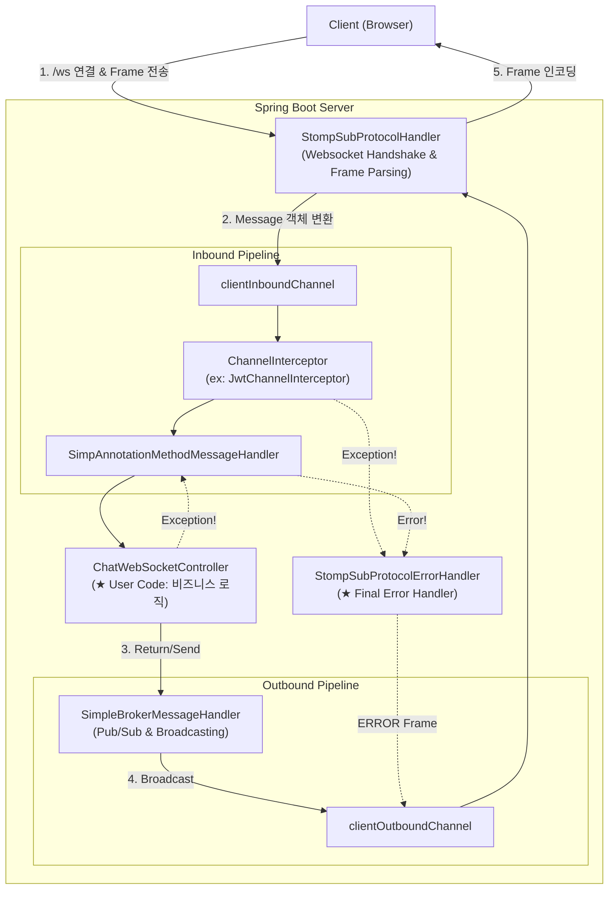

# Spring STOMP Architecture & Error Handling Flow

이 문서는 Spring Framework 내부에서 STOMP 메시지가 처리되는 **전체 데이터 파이프라인(Pipeline)**과, 각 단계에서 발생하는 **에러 핸들링 메커니즘**을 설명합니다.

## 1. Architecture Overview (Mermaid)

클라이언트의 메시지가 서버에 도달하여 처리되고, 다시 나가는 전체 흐름도입니다.

---

## 2. 상세 처리 단계 (Step-by-Step)

### Step 1: 연결 및 파싱 (`StompSubProtocolHandler`)
*   **역할**: 가장 앞단에서 TCP/WebSocket 연결을 관리합니다.
*   **동작**: 
    1. 클라이언트가 보낸 Raw Byte 데이터를 수신.
    2. STOMP 규격에 맞춰 파싱 (Command, Header, Body 분리).
    3. Spring 내부용 `Message` 객체로 변환하여 Inbound Channel로 넘김.

### Step 2: 인터셉터 검문 (`JwtChannelInterceptor`)
*   **위치**: `clientInboundChannel`의 입구.
*   **역할**: 메시지가 Controller나 Broker로 가기 전에 가로채서 검사합니다.
*   **현재 구현**:
    *   `CONNECT` 프레임일 경우 `Authorization` 헤더 검증.
    *   **검증 실패 시**: `MessageDeliveryException`을 던져 즉시 흐름 중단 -> **ErrorHandler로 이동**.
    *   *Note: 세션 ID가 생성되기도 전(헤더 파싱 불가, 프로토콜 위반 등)에 에러가 발생하면, ERROR 프레임 전송 없이 즉시 TCP 연결이 끊길 수 있습니다.*

### Step 3: 라우팅 및 로직 수행 (`ChatWebSocketController`)
*   **위치**: 인터셉터를 통과한 안전한 메시지가 도착하는 곳.
*   **역할**: `@MessageMapping`에 따라 비즈니스 로직을 수행하고 DB에 저장합니다.
*   **에러 처리**:
    *   `try-catch`로 예외를 잡으면: 정상 흐름 유지 (로그만 남음).
    *   `throw Exception` 하면: **ErrorHandler로 이동**.

### Step 4: 브로커 및 응답 (`SimpleBroker`)
*   **역할**: 특정 토픽(`/topic/..`)을 구독 중인 사용자들에게 메시지를 복제하여 뿌려줍니다.

---

## 3. 에러 핸들링 메커니즘 (`StompSubProtocolErrorHandler`)

Spring STOMP의 모든 예외는 최종적으로 **`StompSubProtocolErrorHandler`**가 처리합니다.

#### **Scenario A: 인증 실패 (Interceptor Error)**
1.  `JwtChannelInterceptor`에서 예외 발생 (`throw new MessageDeliveryException`).
2.  `StompSubProtocolErrorHandler`가 이를 감지.
3.  **Action**:
    *   **ERROR Frame 생성**: 예외 메시지를 Payload에 담음.
    *   **전송**: Client에게 발송.
    *   **연결 종료**: 보안을 위해 Socket 연결을 즉시 끊음 (`close`).

#### **Scenario B: 로직 실패 (Controller Error)**
1.  `ChatWebSocketController`에서 예외 발생 (`throw new RuntimeException`).
2.  `StompSubProtocolErrorHandler`가 이를 감지.
3.  **Action**:
    *   **ERROR Frame 생성**: "Internal Server Error" 등.
    *   **전송 & 연결 종료**: STOMP 프로토콜 원칙상 ERROR가 발생하면 연결을 끊는 것이 기본 동작.

#### **Scenario C: 우아한 에러 처리 (Best Practice)**
Controller에서 예외가 발생해도 연결을 끊지 않고 에러 메시지만 보내려면, **`@MessageExceptionHandler`**를 사용해야 합니다.

1.  `@MessageMapping` 메소드에서 예외 발생.
2.  `@MessageExceptionHandler`가 예외를 Catch (ErrorHandler로 넘어가지 않음).
3.  **Action**:
    *   `/queue/errors` 등의 경로로 사용자에게 에러 메시지 전송 (`convertAndSendToUser`).
    *   **연결 유지**: 정상적인 메시지 흐름으로 처리되므로 연결이 끊기지 않음.

---

## 4. 요약
> 메시지는 **Inbound Channel**이라는 고속도로를 타고 흐르며, 중간 검문소(**Interceptor**)와 목적지(**Controller**)를 거칩니다. 어디서든 사고(**Exception**)가 발생하면 **ErrorHandler**가 출동하여 **ERROR Frame**을 보내고 고속도로를 폐쇄(**Close**)합니다.
