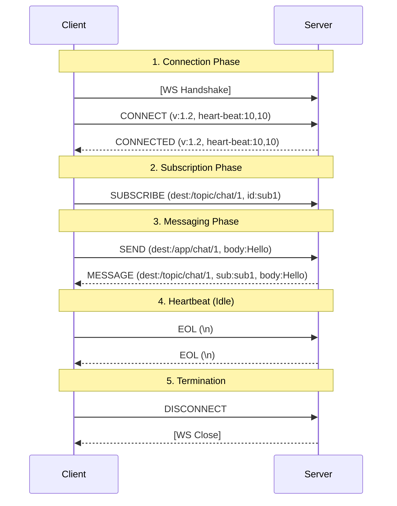

# STOMP Protocol Workflow Guide

STOMP(Simple Text Oriented Messaging Protocol)는 WebSocket 위에서 동작하는 텍스트 기반의 메시징 프로토콜입니다. HTTP와 유사하게 `Start-Line`, `Headers`, `Body` 구조를 가지며, **"Command"**를 기반으로 동작합니다.

## 1. 전체 프로토콜 흐름 (Standard Flow)

일반적인 채팅 애플리케이션에서의 STOMP 생명주기입니다.

### 1-1. Handshake & Connection (연결 및 협상)
가장 먼저 물리적인 WebSocket 연결을 맺고, 그 위에서 STOMP 세션을 시작합니다.

1.  **WebSocket Handshake**: `ws://domain/ws` 로 TCP 연결 수립.
2.  **STOMP CONNECT**: 클라이언트가 프로토콜 시작을 알림.
    *   `accept-version`: 사용 가능한 버전 (1.0, 1.1, 1.2)
    *   `heart-beat`: "나 10초마다 보낼 수 있고, 10초마다 받고 싶어" (`10000,10000`)
3.  **STOMP CONNECTED**: 서버가 승인.
    *   `version`: 버전 확정 (1.2)
    *   `heart-beat`: "그래, 그럼 우리 10초마다 생존신고 하자" (`10000,10000`)
    *   *협상 완료 및 세션 시작*

### 1-2. Subscription (구독)
메시지를 받기 위해 특정 우체통(Topic)을 구독합니다.

1.  **SUBSCRIBE**: "나 1번 방 메시지 받을래."
    *   `destination`: `/topic/chat/1`
    *   `id`: `sub-0` (이 구독의 고유 ID)
2.  **RECEIPT** (Optional): 서버가 "구독 처리했어"라고 응답. (보통 생략)

### 1-3. Messaging (메시지 교환)
실제 데이터를 주고받습니다.

1.  **SEND**: 클라이언트 -> 서버
    *   `destination`: `/app/chat/1/send`
    *   `body`: `{"msg": "Hello"}`
2.  **MESSAGE**: 서버 -> 클라이언트 (구독자에게 브로드캐스팅)
    *   `destination`: `/topic/chat/1`
    *   `subscription`: `sub-0` (어떤 구독 때문에 온 건지 알려줌)
    *   `message-id`: 고유 메시지 ID
    *   `body`: `{"sender": "A", "msg": "Hello"}`

### 1-4. Heartbeat (생존 신고)
데이터 전송이 없을 때, 연결이 끊기지 않도록 빈 패킷을 보냅니다.

*   **Client -> Server**: 줄바꿈 문자(`\n`, Byte `0x0A`) 전송 (Ping)
*   **Server -> Client**: 줄바꿈 문자(`\n`, Byte `0x0A`) 전송 (Pong)
*   *규정된 시간 내에 이게 안 오면 연결 종료로 간주*

> **참고**: Heartbeat는 STOMP Frame이 아니라 순수한 Byte 단위의 **Keep-alive signal**입니다.

### 1-5. Disconnection (종료)
연결을 우아하게 끊기 위해(Graceful Shutdown) `DISCONNECT` 프레임을 사용합니다.

1.  **UNSUBSCRIBE**: "더 이상 이 방 메시지 안 받을래." (구독 해제)
    *   `id`: `sub-0`
2.  **DISCONNECT**: "나 이제 나갈게, 잘 처리됐는지 확인해줘."
    *   `receipt`: `close-123` (서버가 확인했다는 응답을 보내달라는 요청)

**STOMP Frame Example (Client -> Server):**
```stomp
DISCONNECT
receipt:close-123

^@
```

3.  **RECEIPT**: 서버가 "확인했어, 이제 끊어도 돼."
    *   `receipt-id`: `close-123`

**STOMP Frame Example (Server -> Client):**
```stomp
RECEIPT
receipt-id:close-123

^@
```

4.  **WebSocket Close**: 클라이언트가 물리적 연결 종료 (`session.close()`)

---

## 2. Sequence Diagram (Visualized)



---

## 3. 핵심 규칙 (Key Rules)
1.  **Command 필수**: 모든 프레임은 `CONNECT`, `SEND`, `SUBSCRIBE` 등 명령어로 시작해야 합니다.
2.  **Destination 기반**: Rest API의 URL처럼, `destination` 헤더가 핵심 라우팅 키입니다.
3.  **Text 기반**: 기본적으로 텍스트 프로토콜이지만, Body에는 JSON, Binary 등 무엇이든 담을 수 있습니다.
