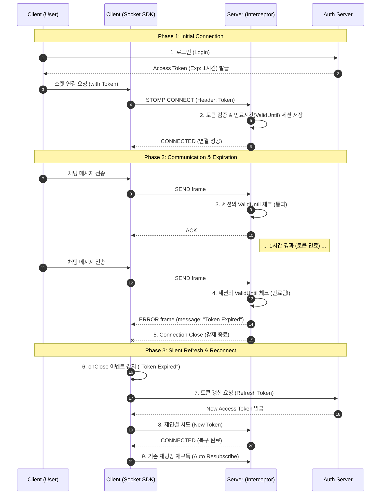

# WebSocket Token Lifecycle & Re-authentication Workflow

이 문서는 WebSocket 연결부터 토큰 만료 시 강제 종료, 그리고 클라이언트의 재연결(Silent Refresh)까지의 **전체 수명주기(Lifecycle)**를 설명합니다.

## 1. 개요 (Overview)

웹소켓은 한 번 연결되면 세션이 계속 유지되는 특성이 있어, **"연결 시점의 토큰이 만료되어도 통신이 가능한 보안 공백"**이 발생할 수 있습니다. 이를 해결하기 위해 서버는 만료를 감지하여 끊고, 클라이언트는 갱신하여 다시 붙는 순환 구조가 필요합니다.

---

## 2. 전체 흐름 (Full Sequence)



---

## 3. 단계별 상세 로직 (Detailed Logic)

### Phase 1: Initial Connection (서버)
*   **파일**: `JwtChannelInterceptor.kt`
*   **동작**:
    *   `CONNECT` 프레임 수신 시 JWT를 검증합니다.
    *   **핵심**: 토큰 검증 후, **만료 시간(Expiration Time)**을 `SimpMessageHeaderAccessor.sessionAttributes`에 저장해 둡니다.
    ```kotlin
    val expiration = jwtTokenProvider.getExpiration(token)
    sessionAttributes["TOKEN_EXP"] = expiration
    ```

### Phase 2: Expiration Check (서버)
*   **파일**: `JwtChannelInterceptor.kt`
*   **동작**:
    *   `SEND`, `SUBSCRIBE` 등 모든 프레임이 들어올 때마다(`else` 블록), 세션에 저장해둔 `TOKEN_EXP`를 꺼냅니다.
    *   `if (System.currentTimeMillis() > expiration)` 이면 예외를 던집니다.
    ```kotlin
    throw MessageDeliveryException("Token Expired")
    // 이 예외는 STOMP ERROR Frame으로 변환되어 클라이언트에 전달되고 연결이 끊깁니다.
    ```

### Phase 3: Silent Refresh (클라이언트)
*   **파일**: 프론트엔드 Socket SDK
*   **동작**:
    *   소켓이 끊기면(`onClose`), 종료 사유(Close Reason)나 마지막 에러 메시지를 확인합니다.
    *   사유가 `"Token Expired"`라면, 사용자를 로그아웃시키는 대신 **백그라운드에서 토큰 갱신 API**를 호출합니다.
    *   갱신 성공 시, **새로운 토큰으로 즉시 재연결(`client.activate()`)**을 시도합니다.
    *   이 모든 과정 중에 유저는 끊김을 인지하지 못하도록 처리합니다(Loading Indicator 최소화).

---

## 4. 구현 체크리스트

### Server Side
- [ ] `JwtChannelInterceptor`에 토큰 만료 시간 추출 및 저장 로직 추가
- [ ] `preSend` 메소드에 만료 시간 비교 로직 추가 (`CONNECT` 제외한 모든 커맨드 대상)

### Client Side
- [ ] 소켓 연결 끊김 핸들러(`onWebSocketClose`) 구현
- [ ] 만료 에러 감지 시 `authRepository.refreshToken()` 호출 로직
- [ ] 토큰 갱신 후 소켓 재연결 및 기존 구독(Subscription) 복구 로직

---

이 워크플로우를 따르면 보안성을 유지하면서도 사용자 경험(UX)을 해치지 않는 안정적인 채팅 서비스를 제공할 수 있습니다.
