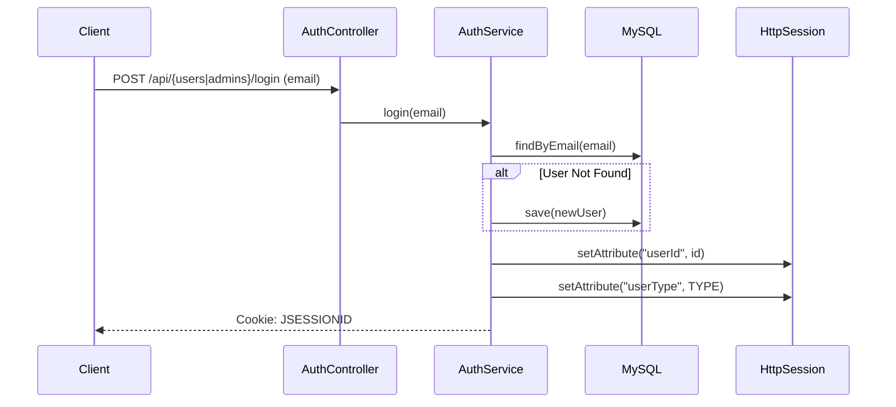
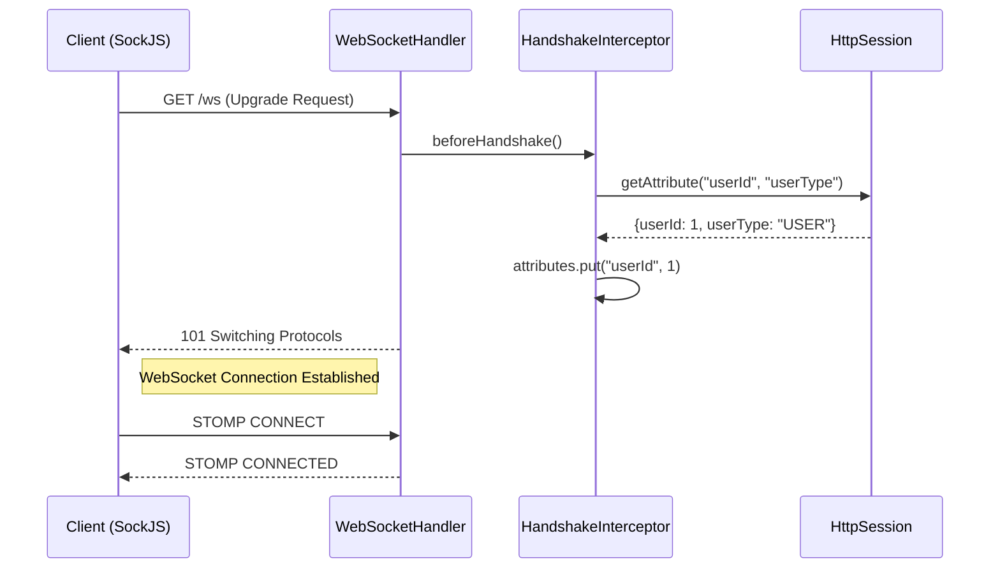
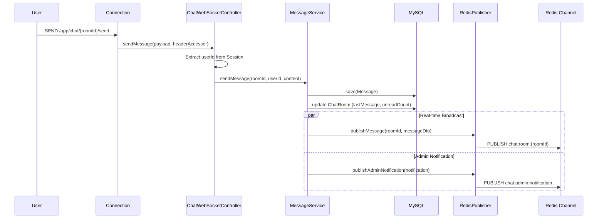
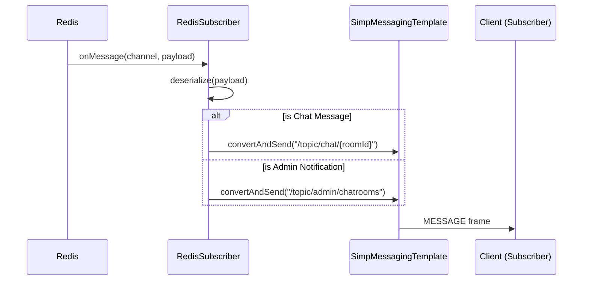
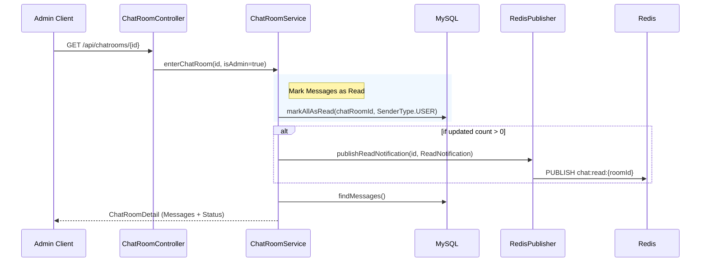
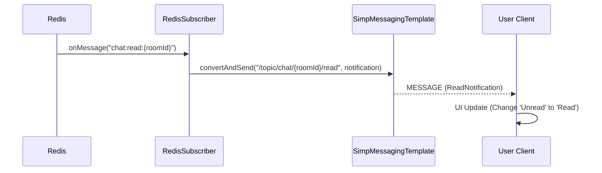
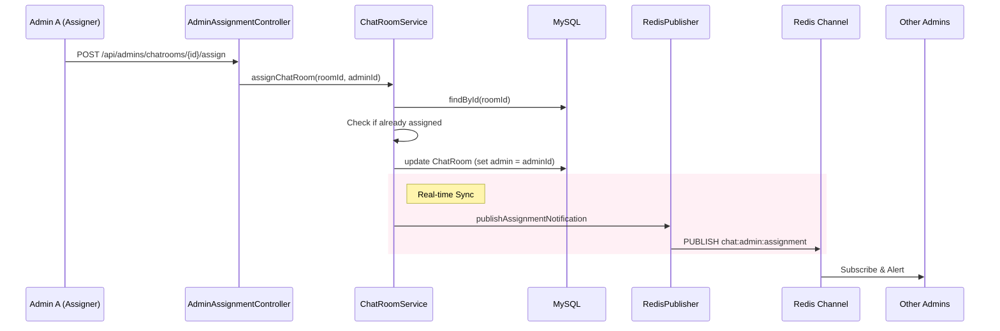

# Chat POC - Backend Developer Workflow Guide

## 1. 개요
이 문서는 Chat POC 프로젝트의 핵심 기능에 대한 서버 내부 동작 흐름을 설명합니다. 
WebSocket 연결, Redis Pub/Sub 메시징, 읽음 처리 로직 등 백엔드 개발자가 파악해야 할 상세 흐름을 **Mermaid Sequence Diagram**과 함께 기술했습니다.
특히 WebSocket 통신 구간에서는 **STOMP 프로토콜**의 상세 프레임 구조를 포함하여 패킷 수준의 이해를 돕습니다.

---

## 2. 인증 및 세션 (Authentication Flow)
단순화를 위해 Spring Session과 HttpSession을 사용하며, 클라이언트(Browser)는 기본 쿠키(`JSESSIONID`) 기반으로 인증을 유지합니다.

### 2.1 로그인 및 세션 생성
User가 이메일 입력 시 DB에 없으면 자동 생성 후 세션을 발급합니다.



#### ✉️ HTTP Request Spec
**POST** `/api/admins/login`
```json
{
  "email": "admin1@email.com"
}
```

---

## 3. 웹소켓 연결 및 핸드셰이크 (WebSocket Handshake)
HTTP 세션에 저장된 사용자 정보를 WebSocket 세션으로 이관하는 과정이 필수적입니다.
`WebSocketHandshakeInterceptor`가 이 역할을 수행합니다.



#### ✉️ STOMP Frame: CONNECT
```text
CONNECT
accept-version:1.1,1.0
heart-beat:10000,10000

^@
```

#### ✉️ STOMP Frame: CONNECTED
```text
CONNECTED
version:1.1
heart-beat:0,0
user-name:user1@email.com

^@
```

---

## 4. 실시간 메시지 전송 (Real-time Messaging Flow)
STOMP 프로토콜을 사용하여 메시지를 전송하고, **Redis Pub/Sub**을 통해 다중 서버 환경(확장 고려)에서도 메시지가 전파되도록 설계되었습니다.

### 4.1 메시지 전송 및 저장


#### ✉️ STOMP Frame: SEND (Client → Server)
클라이언트가 대화 내용을 서버로 전송할 때 사용하는 프레임입니다.
```text
SEND
destination:/app/chat/1/send
content-length:45

{"content":"안녕하세요, 문의드립니다."}
^@
```
- **destination**: `/app` prefix는 `@MessageMapping`이 처리합니다.

#### ✉️ Redis Publish (Internal)
서버 내부에서 Redis로 Broadcasting 하는 페이로드입니다.
**Channel**: `chat:room:1`
```json
{
  "id": 101,
  "chatRoomId": 1,
  "senderId": 10,
  "senderType": "USER",
  "content": "안녕하세요, 문의드립니다.",
  "createdAt": "2026-01-09 16:30:26"
}
```

### 4.2 메시지 수신 및 전달 (구독자에게)
Redis Subscriber가 메시지를 수신하여 WebSocket을 통해 접속 중인 클라이언트들에게 전달합니다.



#### ✉️ STOMP Frame: MESSAGE (Server → Client)
구독 중인 클라이언트에게 전달되는 메시지 프레임입니다.
```text
MESSAGE
destination:/topic/chat/1
content-type:application/json
subscription:sub-0
message-id:nx92k-0

{"id":101,"chatRoomId":1,"senderId":10,"senderType":"USER","content":"안녕하세요","createdAt":"..."}
^@
```

---

## 5. 읽음 처리 프로세스 (Read Status Flow)
채팅방 입장 시 또는 실시간으로 상대방이 메시지를 읽었을 때의 처리 과정입니다.

### 5.1 채팅방 입장 시 읽음 처리
Admin이 채팅방에 입장하면 User가 보낸 메시지들을 '읽음'으로 처리합니다.



### 5.2 읽음 알림 전달 (실시간 업데이트)
상대방이 메시지를 읽었음(입장함)을 실시간으로 내 화면에 반영합니다.



#### ✉️ STOMP Frame: MESSAGE (Read Notification)
```text
MESSAGE
destination:/topic/chat/1/read
content-type:application/json
subscription:sub-1
message-id:nx92k-1

{"chatRoomId":1,"readByType":"ADMIN","readAt":"2026-01-09 17:00:00"}
^@
```

---

## 6. 상담사 배정 (Assignment Flow)
관리자가 미배정 채팅방을 담당자로 배정받는 과정입니다. 다른 관리자들의 화면에서도 해당 방이 '미배정' 목록에서 사라지도록 동기화해야 합니다.

### 6.1 배정 요청 및 알림


### 6.2 배정 알림 수신 (For Sync)
Redis Subscriber가 배정 알림을 수신하여 `/topic/admin/assignments`를 구독 중인 모든 관리자에게 브로드캐스팅합니다.

#### ✉️ Redis Publish Payload
**Channel**: `chat:admin:assignment`
```json
{
  "chatRoomId": 1,
  "assignedAdminId": 5,
  "assignedAdminEmail": "admin1@email.com",
  "assignedAt": "2026-01-09 18:30:00"
}
```

#### ✉️ STOMP Frame: MESSAGE (Assignment Notification)
관리자 클라이언트는 이 메시지를 받으면:
1. 배정자가 **자신**이면, '미배정' 탭에서 방을 제거하고 '내 상담' 및 '목록'을 갱신합니다.
2. 배정자가 **타인**이면, '미배정' 탭에서 방을 즉시 제거합니다.

```text
MESSAGE
destination:/topic/admin/assignments
content-type:application/json
subscription:sub-admin-noti

{"chatRoomId":1,"assignedAdminId":5,"assignedAdminEmail":"admin1@email.com","assignedAt":"..."}
^@
```
