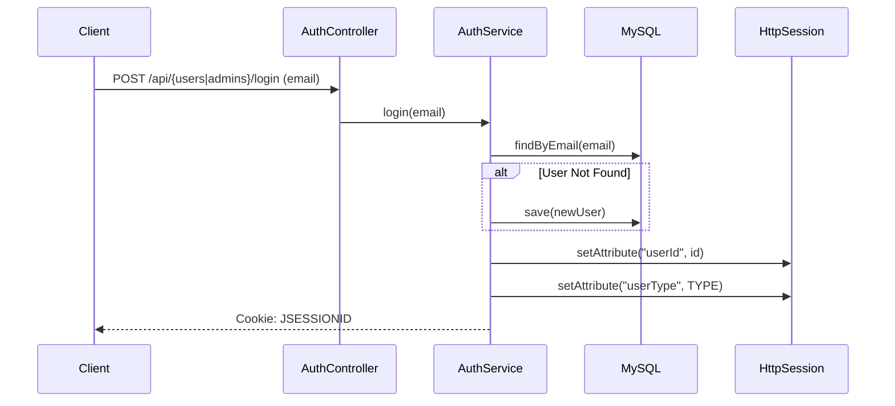
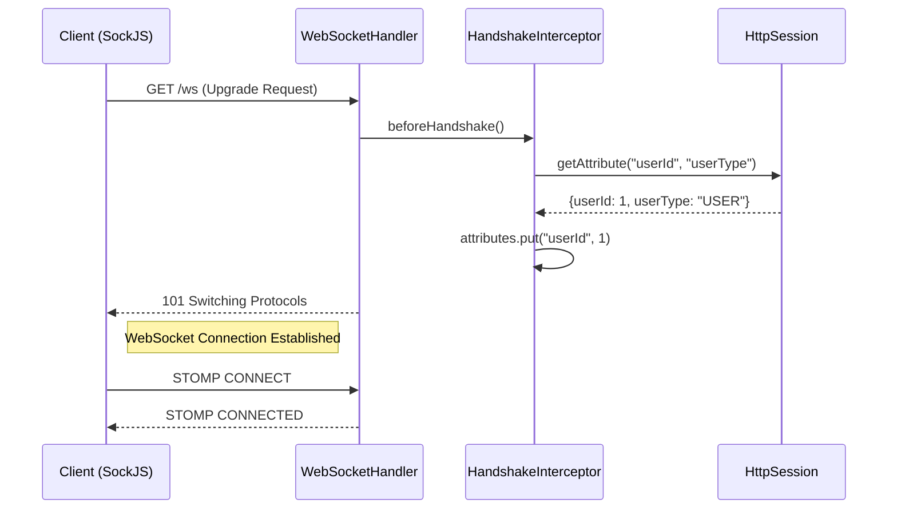
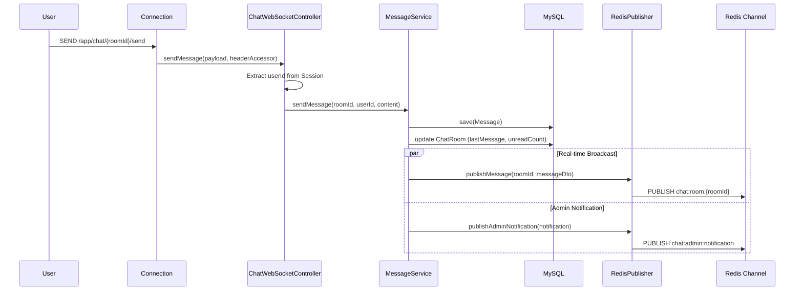
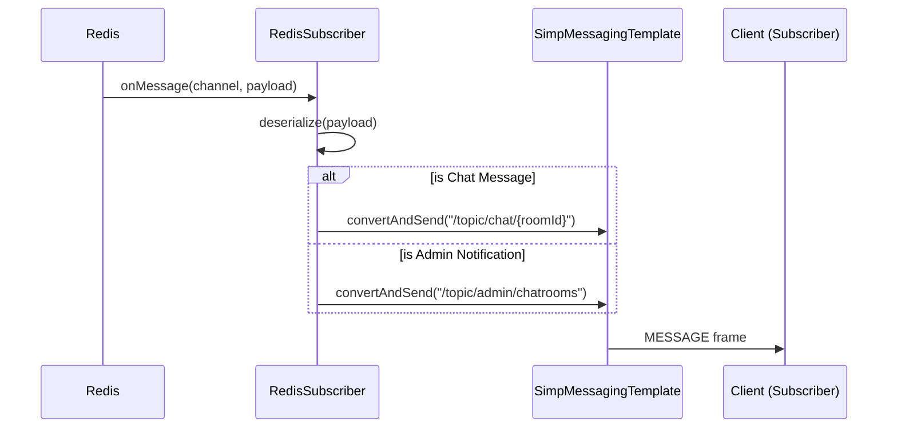
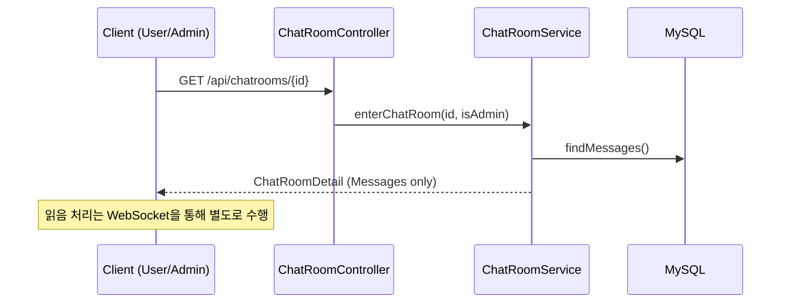
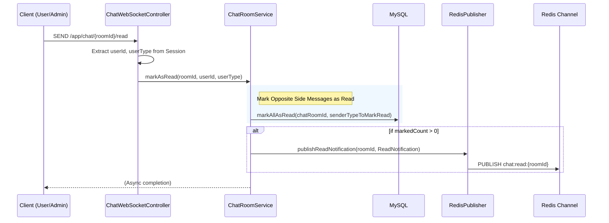
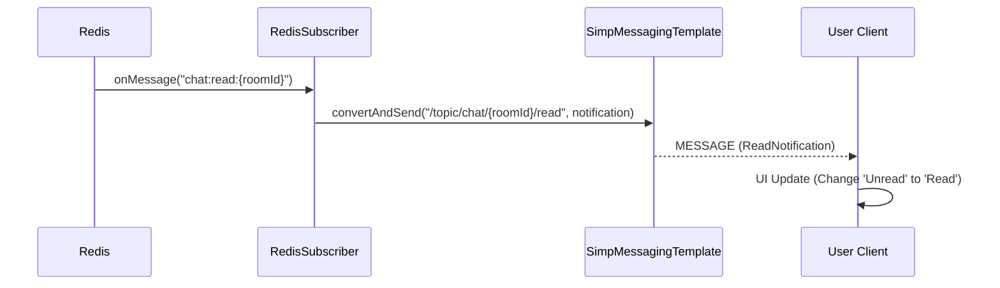
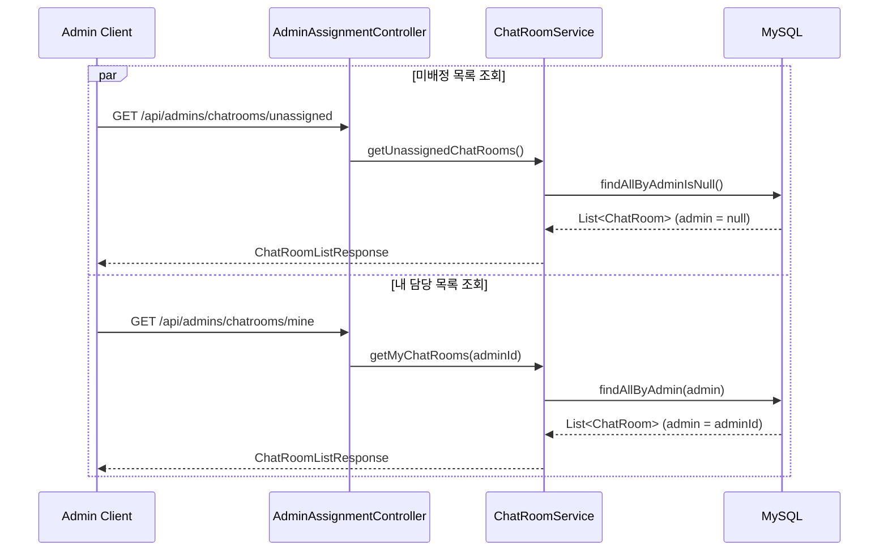
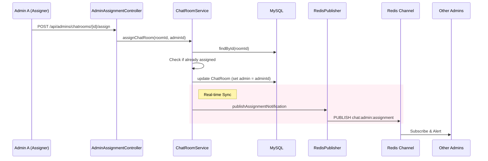
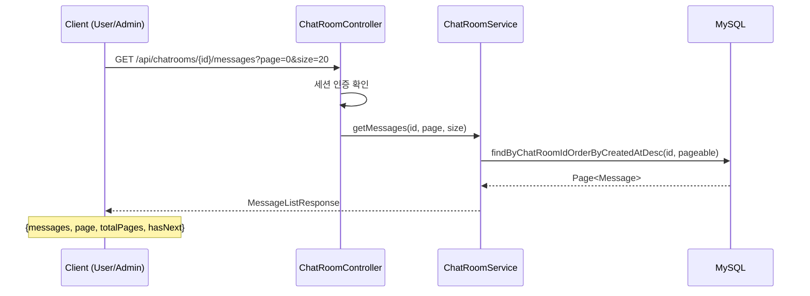

# Chat POC - Backend Developer Workflow Guide

## 1. 개요
이 문서는 Chat POC 프로젝트의 핵심 기능에 대한 서버 내부 동작 흐름을 설명합니다. 
WebSocket 연결, Redis Pub/Sub 메시징, 읽음 처리 로직 등 백엔드 개발자가 파악해야 할 상세 흐름을 **Mermaid Sequence Diagram**과 함께 기술했습니다.
특히 WebSocket 통신 구간에서는 **STOMP 프로토콜**의 상세 프레임 구조를 포함하여 패킷 수준의 이해를 돕습니다.

---

## 2. 인증 및 세션 (Authentication Flow)
단순화를 위해 Spring Session과 HttpSession을 사용하며, 클라이언트(Browser)는 기본 쿠키(`JSESSIONID`) 기반으로 인증을 유지합니다.

### 2.1 로그인 및 세션 생성
User가 이메일 입력 시 DB에 없으면 자동 생성 후 세션을 발급합니다.



#### ✉️ HTTP Request Spec

**POST** `/api/users/login` (User 로그인)
**POST** `/api/admins/login` (Admin 로그인)

**Request Body**:
```json
{
  "email": "admin1@email.com"
}
```

**Response**: `LoginResponse`
```json
{
  "success": true,
  "data": {
    "id": 5,
    "email": "admin1@email.com",
    "userType": "ADMIN"
  }
}
```
- **userType**: "USER" 또는 "ADMIN"
- 이메일이 DB에 없으면 자동으로 생성 후 로그인 처리
- 세션에 `userId`, `userType`이 저장되고, `JSESSIONID` 쿠키 발급

---

## 3. 웹소켓 연결 및 핸드셰이크 (WebSocket Handshake)
HTTP 세션에 저장된 사용자 정보를 WebSocket 세션으로 이관하는 과정이 필수적입니다.
`WebSocketHandshakeInterceptor`가 이 역할을 수행합니다.



#### ✉️ STOMP Frame: CONNECT
```text
CONNECT
accept-version:1.1,1.0
heart-beat:10000,10000

^@
```

#### ✉️ STOMP Frame: CONNECTED
```text
CONNECTED
version:1.1
heart-beat:0,0
user-name:user1@email.com

^@
```

---

## 4. 실시간 메시지 전송 (Real-time Messaging Flow)
STOMP 프로토콜을 사용하여 메시지를 전송하고, **Redis Pub/Sub**을 통해 다중 서버 환경(확장 고려)에서도 메시지가 전파되도록 설계되었습니다.

### 4.1 메시지 전송 및 저장


#### ✉️ STOMP Frame: SEND (Client → Server)
클라이언트가 대화 내용을 서버로 전송할 때 사용하는 프레임입니다.
```text
SEND
destination:/app/chat/1/send
content-length:45

{"content":"안녕하세요, 문의드립니다."}
^@
```
- **destination**: `/app` prefix는 `@MessageMapping`이 처리합니다.

#### ✉️ Redis Publish (Internal) - Chat Message
서버 내부에서 Redis로 Broadcasting 하는 메시지 페이로드입니다.

**Channel**: `chat:room:1`
```json
{
  "id": 101,
  "chatRoomId": 1,
  "senderId": 10,
  "senderType": "USER",
  "content": "안녕하세요, 문의드립니다.",
  "createdAt": "2026-01-09 16:30:26"
}
```

#### ✉️ Redis Publish (Internal) - Admin Notification
User가 메시지를 보낼 때 Admin에게 채팅방 업데이트 알림을 전송하는 페이로드입니다.

**Channel**: `chat:admin:notification`
```json
{
  "chatRoomId": 1,
  "userEmail": "user1@email.com",
  "unreadCount": 1,
  "lastMessageContent": "안녕하세요, 문의드립니다.",
  "lastMessageAt": "2026-01-09 16:30:26",
  "assignedAdminId": null
}
```
- **assignedAdminId**: 배정된 Admin의 ID (미배정 시 null)

### 4.2 메시지 수신 및 전달 (구독자에게)
Redis Subscriber가 메시지를 수신하여 WebSocket을 통해 접속 중인 클라이언트들에게 전달합니다.



#### ✉️ STOMP Frame: MESSAGE (Chat Message)
구독 중인 클라이언트에게 전달되는 메시지 프레임입니다.
```text
MESSAGE
destination:/topic/chat/1
content-type:application/json
subscription:sub-0
message-id:nx92k-0

{"id":101,"chatRoomId":1,"senderId":10,"senderType":"USER","content":"안녕하세요","createdAt":"..."}
^@
```

#### ✉️ STOMP Frame: MESSAGE (Admin Notification)
관리자 대시보드 목록 갱신을 위해 전달되는 알림입니다. `assignedAdminId`를 통해 '미배정'/'내 상담' 탭을 구분합니다.
```text
MESSAGE
destination:/topic/admin/chatrooms
content-type:application/json
subscription:sub-admin-0

{
  "chatRoomId": 1,
  "userEmail": "user1@email.com",
  "unreadCount": 1,
  "lastMessageContent": "안녕하세요",
  "lastMessageAt": "2026-01-09 16:30:26",
  "assignedAdminId": null
}
^@
```

---

## 5. 읽음 처리 프로세스 (Read Status Flow)
실시간 WebSocket 기반의 읽음 처리 프로세스입니다. 채팅방 입장 시 또는 메시지 수신 시 클라이언트가 명시적으로 "Read" 명령을 전송하여 읽음 상태를 동기화합니다.

### 5.1 채팅방 입장 (데이터 조회)
채팅방에 입장할 때 메시지 목록과 채팅방 정보를 조회합니다. **읽음 처리는 별도의 WebSocket 명령으로 수행됩니다.**



#### ✉️ HTTP Request Spec
**GET** `/api/chatrooms/{id}`
- **Path Parameter**: `id` (채팅방 ID)
- **세션 인증 필요**: User 또는 Admin
- **권한**: User는 본인 채팅방만 접근 가능, Admin은 모든 채팅방 접근 가능
- **동작**: 메시지 목록만 조회하며, 읽음 처리는 수행하지 않음

**Response**: `ChatRoomDetailResponse`
```json
{
  "success": true,
  "data": {
    "id": 1,
    "userEmail": "user1@email.com",
    "assignedAdminEmail": "admin1@email.com",
    "messages": [
      {
        "id": 101,
        "senderId": 10,
        "senderType": "USER",
        "content": "안녕하세요",
        "isRead": false,
        "readAt": null,
        "createdAt": "2026-01-09 16:30:26"
      }
    ],
    "createdAt": "2026-01-09 15:00:00"
  }
}
```

### 5.2 실시간 읽음 처리 (WebSocket Read Command)
클라이언트가 채팅방 입장 시 또는 메시지 수신 시 명시적으로 읽음 명령을 전송합니다. 서버는 상대방이 보낸 메시지를 읽음 처리하고 Redis를 통해 실시간 알림을 전송합니다.



#### ✉️ STOMP Frame: SEND (Read Command)
클라이언트가 읽음 처리를 요청할 때 전송하는 프레임입니다.
```text
SEND
destination:/app/chat/1/read
content-length:0

^@
```
- **destination**: `/app/chat/{roomId}/read`
- **body**: 없음 (빈 메시지)
- **호출 시점**:
  - 채팅방 입장 시 (HTTP API 호출 후)
  - 메시지 수신 시 (실시간 읽음 처리)

#### ✉️ Redis Publish (Internal) - Read Notification
읽음 처리가 발생하면 상대방에게 알림을 전송하는 페이로드입니다.

**Channel**: `chat:read:{roomId}`
```json
{
  "chatRoomId": 1,
  "readByType": "ADMIN",
  "readAt": "2026-01-09 17:00:00"
}
```
- **readByType**: 누가 읽었는지 ("USER" 또는 "ADMIN")

### 5.3 읽음 알림 전달 (실시간 업데이트)
상대방이 메시지를 읽었음(입장함)을 실시간으로 내 화면에 반영합니다.



#### ✉️ STOMP Frame: MESSAGE (Read Notification)
```text
MESSAGE
destination:/topic/chat/1/read
content-type:application/json
subscription:sub-1
message-id:nx92k-1

{"chatRoomId":1,"readByType":"ADMIN","readAt":"2026-01-09 17:00:00"}
^@
```

---

## 6. 상담사 배정 (Assignment Flow)
관리자가 미배정 채팅방을 담당자로 배정받는 과정입니다. 다른 관리자들의 화면에서도 해당 방이 '미배정' 목록에서 사라지도록 동기화해야 합니다.

### 6.1 미배정/내 상담 목록 조회
관리자는 채팅방 목록을 필터링하여 조회할 수 있습니다.



#### ✉️ HTTP Request Spec
**GET** `/api/admins/chatrooms/unassigned`
- **세션 인증 필요**: Admin
- **응답**: `ChatRoomListResponse` (admin이 null인 채팅방 목록)

**GET** `/api/admins/chatrooms/mine`
- **세션 인증 필요**: Admin
- **응답**: `ChatRoomListResponse` (현재 로그인한 Admin이 배정된 채팅방 목록)

**Response**: `ChatRoomListResponse`
```json
{
  "success": true,
  "data": {
    "chatRooms": [
      {
        "id": 1,
        "userId": 10,
        "userEmail": "user1@email.com",
        "unreadCount": 3,
        "lastMessageContent": "문의드립니다",
        "lastMessageAt": "2026-01-09 16:30:26",
        "assignedAdminEmail": null,
        "createdAt": "2026-01-09 15:00:00"
      },
      {
        "id": 2,
        "userId": 11,
        "userEmail": "user2@email.com",
        "unreadCount": 0,
        "lastMessageContent": "감사합니다",
        "lastMessageAt": "2026-01-09 14:20:15",
        "assignedAdminEmail": "admin1@email.com",
        "createdAt": "2026-01-09 14:00:00"
      }
    ]
  }
}
```
- **unreadCount**: User가 보낸 읽지 않은 메시지 수
- **assignedAdminEmail**: 배정된 Admin 이메일 (미배정 시 null)

### 6.2 배정 요청 및 알림


#### ✉️ HTTP Request Spec
**POST** `/api/admins/chatrooms/{id}/assign`
- **Path Parameter**: `id` (채팅방 ID)
- **세션 인증 필요**: Admin
- **동작**: 현재 로그인한 Admin을 해당 채팅방의 담당자로 배정

**Request Body**: 없음

**Response**: `ApiResponse<Unit>`
```json
{
  "success": true,
  "data": null
}
```

**Error Cases**:
- 이미 배정된 채팅방: `400 Bad Request`
- 채팅방 미존재: `404 Not Found`
- Admin 미인증: `401 Unauthorized`

### 6.3 배정 알림 수신 (For Sync)
Redis Subscriber가 배정 알림을 수신하여 `/topic/admin/assignments`를 구독 중인 모든 관리자에게 브로드캐스팅합니다.

#### ✉️ Redis Publish Payload

**Channel**: `chat:admin:assignment`
```json
{
  "chatRoomId": 1,
  "assignedAdminId": 5,
  "assignedAdminEmail": "admin1@email.com",
  "assignedAt": "2026-01-09 18:30:00"
}
```

#### ✉️ STOMP Frame: MESSAGE (Assignment Notification)
관리자 클라이언트는 이 메시지를 받으면:
1. 배정자가 **자신**이면, '미배정' 탭에서 방을 제거하고 '내 상담' 및 '목록'을 갱신합니다.
2. 배정자가 **타인**이면, '미배정' 탭에서 방을 즉시 제거합니다.

```text
MESSAGE
destination:/topic/admin/assignments
content-type:application/json
subscription:sub-admin-noti

{"chatRoomId":1,"assignedAdminId":5,"assignedAdminEmail":"admin1@email.com","assignedAt":"..."}
^@
```

---

## 7. 메시지 페이지네이션 조회 (Message Pagination)
채팅방 입장 시 전체 메시지가 아닌 페이지 단위로 메시지를 조회할 수 있는 기능입니다. 무한 스크롤 또는 더보기 기능 구현에 활용됩니다.

### 7.1 페이지네이션 조회 프로세스


#### ✉️ HTTP Request Spec
**GET** `/api/chatrooms/{id}/messages`

**Query Parameters**:
- `page` (optional, default=0): 페이지 번호 (0부터 시작)
- `size` (optional, default=20): 페이지당 메시지 수

**Response**: `MessageListResponse`
```json
{
  "success": true,
  "data": {
    "messages": [
      {
        "id": 101,
        "senderId": 10,
        "senderType": "USER",
        "content": "안녕하세요",
        "isRead": true,
        "readAt": "2026-01-09 17:00:00",
        "createdAt": "2026-01-09 16:30:26"
      }
    ],
    "page": 0,
    "size": 20,
    "totalElements": 45,
    "totalPages": 3,
    "hasNext": true
  }
}
```

**Note**:
- 메시지는 최신순(내림차순)으로 정렬되어 반환됩니다.
- User는 본인의 채팅방만 조회 가능하며, Admin은 모든 채팅방 조회 가능합니다.
- 권한이 없는 경우 403 Forbidden을 반환합니다.
